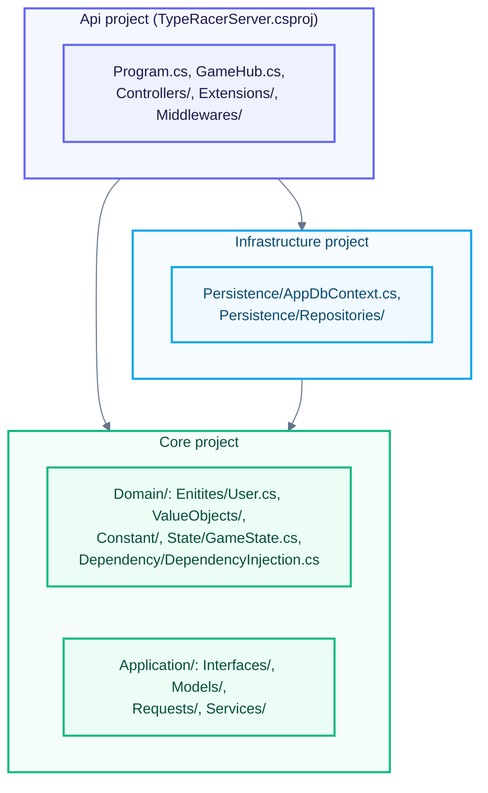
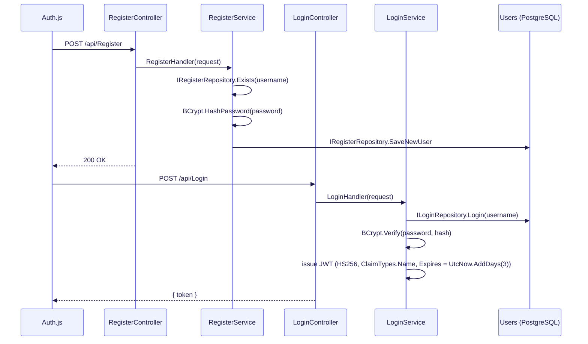
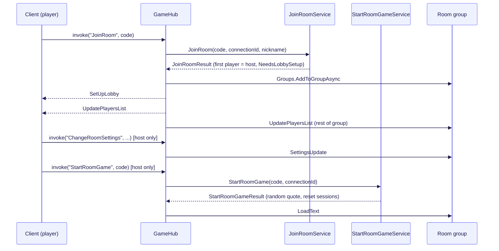
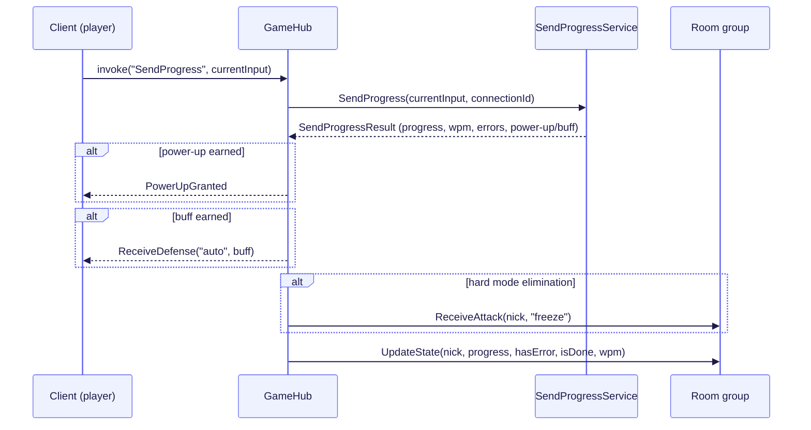
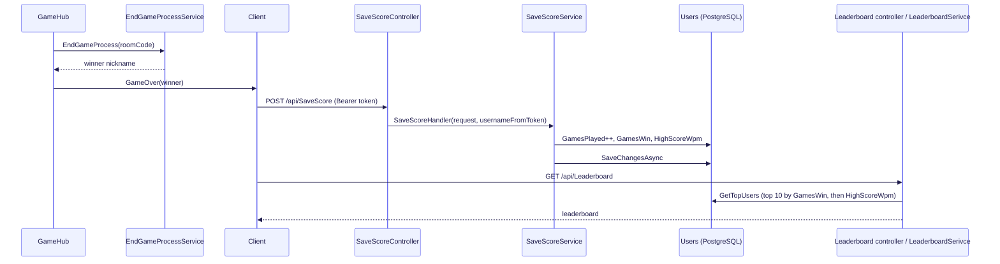
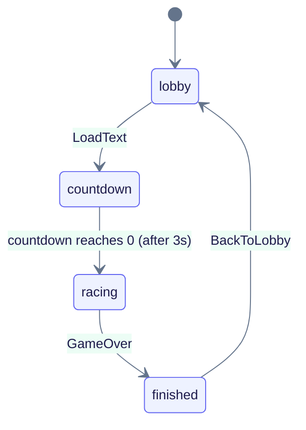
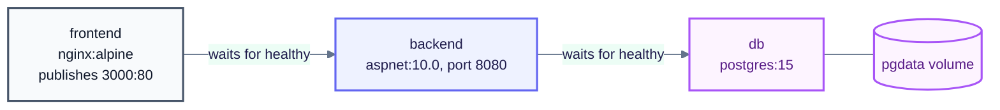

# Architecture

Type Racer is a real-time multiplayer typing race: players join a room by code, race against a shared text, and see each other's progress live. The backend is a .NET 10 API that combines REST controllers with a SignalR hub; the frontend is a React SPA; user accounts and scores are stored in PostgreSQL. This document covers the system context, the backend project layering, the in-memory runtime model, the main request/event flows, the deployment topology, the design patterns in use, and known limitations.

## System context

The diagram shows the three containers a browser talks to and how a request reaches PostgreSQL.

```mermaid
%%{init: {'theme': 'base', 'themeVariables': {'primaryColor': '#EEF2FF', 'primaryTextColor': '#1E1B4B', 'primaryBorderColor': '#6366F1', 'lineColor': '#64748B', 'secondaryColor': '#ECFDF5', 'tertiaryColor': '#FFF7ED', 'fontFamily': 'Inter, Segoe UI, Helvetica, Arial, sans-serif', 'fontSize': '14px'}}}%%
flowchart LR
    classDef client fill:#FFF7ED,stroke:#F97316,stroke-width:2px,color:#7C2D12
    classDef proxy  fill:#F8FAFC,stroke:#475569,stroke-width:2px,color:#0F172A
    classDef api    fill:#EEF2FF,stroke:#6366F1,stroke-width:2px,color:#1E1B4B
    classDef db     fill:#FDF4FF,stroke:#A855F7,stroke-width:2px,color:#581C87

    Browser["Browser<br/>(React SPA)"]:::client -->|"HTTP :3000"| Nginx["nginx :3000<br/>serves static build,<br/>proxies /api/* and /gamehub"]:::proxy
    Nginx -->|"REST /api/*"| Api["ASP.NET Core API<br/>Kestrel :8080<br/>Controllers + GameHub"]:::api
    Nginx -->|"WebSocket /gamehub"| Api
    Api -->|"Npgsql"| Db["PostgreSQL 15<br/>Users table"]:::db
```

The system runs as three containers: `frontend` (nginx serving the React build), `backend` (Kestrel), and `db` (PostgreSQL). Every URL the client calls is relative (`/api/...`, `/gamehub`), so nginx is the single origin the browser talks to; it decides, based on the path, whether to proxy to the backend as plain HTTP or upgrade the connection to a WebSocket.

## Backend layering

The diagram shows the three .NET projects and the folders each one owns; arrows follow `ProjectReference` direction.

This is a layered architecture inspired by Clean Architecture: repository interfaces are declared in the Core project (folders `Domain/` and `Application/` inside `TypeRacerServer/Core`), under `Core/Application/Interfaces/` (for example [`ILoginRepository`](../TypeRacerServer/Core/Application/Interfaces/AccountManagerInterfaces/ILoginRepository.cs)), and implemented in the Infrastructure project (`TypeRacerServer/Infrastructure`), under `Persistence/Repositories/` (for example [`LoginRepository`](../TypeRacerServer/Infrastructure/Persistence/Repositories/LoginRepository.cs)). This inverts the natural dependency: Core does not reference Infrastructure, yet Infrastructure code implements the contracts Core defines, so Core stays free of any EF Core or Npgsql reference.

Inside Core the picture is less strictly layered. [`Domain/State/GameState.cs`](../TypeRacerServer/Core/Domain/State/GameState.cs) uses `Application.Models.PlayerData.PlayerSession` and `Application.Models.RoomResults.RoomState`, and [`Domain/Dependency/DependencyInjection.cs`](../TypeRacerServer/Core/Domain/Dependency/DependencyInjection.cs) registers `Application.Services.*` classes such as `LoginService` and `JoinRoomService` for dependency injection. So `Domain/` depends on `Application/`, not the other way around. `Core/Core.csproj` also references `Microsoft.AspNetCore.Authentication.JwtBearer`, `Microsoft.IdentityModel.Tokens` and `Microsoft.Extensions.DependencyInjection` directly. Taken together, the design is a layered architecture inspired by Clean Architecture rather than a strict onion, where the Core project combines domain state, application services and web-framework packages in one assembly.

## Runtime model

Game state lives entirely in memory, in a singleton [`GameState`](../TypeRacerServer/Core/Domain/State/GameState.cs) registered by `AddCoreServices` in [`Core/Domain/Dependency/DependencyInjection.cs`](../TypeRacerServer/Core/Domain/Dependency/DependencyInjection.cs). It exposes two `ConcurrentDictionary` collections:

- `Rooms: ConcurrentDictionary<string, RoomState>`, keyed by room code.
- `Sessions: ConcurrentDictionary<string, PlayerSession>`, keyed by the SignalR `ConnectionId`.

A room is also a SignalR group named after the room code: [`GameHub.JoinRoom`](../TypeRacerServer/Api/GameHub.cs) calls `Groups.AddToGroupAsync(Context.ConnectionId, HostCode)` after [`JoinRoomService`](../TypeRacerServer/Core/Application/Services/RoomManager/JoinRoomService.cs) accepts the player. Core services never reference SignalR; each one returns a plain result record from `Core/Application/Models/` — `JoinRoomResult`, `StartRoomGameResult`, `SendProgressResult`, `RestartGameResult`, `PerformCleanupResult` and others — and `GameHub` is the only place that turns those records into client events.

Disconnects are handled with a grace period: [`GameHub.OnDisconnectedAsync`](../TypeRacerServer/Api/GameHub.cs) waits 15 seconds (`Task.Delay(15000)`) before calling `PerformCleanupService.PerformCleanup`, so a player whose connection drops briefly (a refresh, a flaky network) has time to reconnect. When that happens, `JoinRoomService.JoinRoom` recognizes the same nickname rejoining the same room code and re-keys the existing `PlayerSession` and room entry to the new `ConnectionId` instead of creating a new player.

Only the `Users` table is persisted to PostgreSQL; rooms, sessions and individual race rounds exist only in the API process's memory and are lost on restart.

## Application flow

### Register and login

The sequence below shows account creation followed by a login that returns a JWT.

1. `Auth.js` posts credentials to `POST /api/Register`; `RegisterController` calls `RegisterService.RegisterHandler`, which checks `IRegisterRepository.Exists`, hashes the password with BCrypt, and calls `IRegisterRepository.SaveNewUser`.
2. `Auth.js` then posts to `POST /api/Login`; `LoginController` calls `LoginService.LoginHandler`, which loads the user through `ILoginRepository.Login`, verifies the password with `BCrypt.Net.BCrypt.Verify`, and on success issues a JWT signed with HS256, carrying a single `ClaimTypes.Name` claim and `Expires = DateTime.UtcNow.AddDays(3)`.
3. The client stores the returned token and the username in `localStorage`.
4. When the SignalR connection is built, `.withUrl("/gamehub", { accessTokenFactory })` supplies the token as the `access_token` query string parameter; [`Api/Extensions/AddAuthentication.cs`](../TypeRacerServer/Api/Extensions/AddAuthentication.cs) reads it back in `OnMessageReceived` for any request path starting with `/gamehub`.
5. `GameHub` is decorated `[Authorize]`, so an unauthenticated connection is rejected; once authenticated, `Context.User.Identity.Name` (the `ClaimTypes.Name` claim) becomes the player's nickname for the rest of the session.

### Join a room and lobby

The sequence below shows a player joining a room, the host configuring it, and the host starting the race.

1. The client calls `invoke("JoinRoom", code)`; `GameHub.JoinRoom` delegates to `JoinRoomService.JoinRoom`, which does `Rooms.GetOrAdd(code, ...)` and makes the first player in an empty room the host, flagging `NeedsLobbySetup`.
2. The hub adds the caller's connection to the SignalR group, sends `SetUpLobby` to the caller only, then sends `UpdatePlayersList` to the caller and to the rest of the group.
3. The host can call `ChangeRoomSettings`; on success `ChangeRoomSettingsService` updates the room and the hub broadcasts `SettingsUpdate` to the group.
4. The host calls `StartRoomGame`; `StartRoomGameService` verifies the caller is the host and the game has not started, picks a random quote from [`Domain/Constant/GameQuotes.cs`](../TypeRacerServer/Core/Domain/Constant/GameQuotes.cs), resets every player session in the room, and returns the text. The hub broadcasts `LoadText` to the group.
5. On `LoadText` the client runs a 3-second countdown locally before entering the racing state.

### Race loop

The sequence below shows one keystroke round-trip while a race is in progress.

1. On every change to the input field the client calls `invoke("SendProgress", currentInput)`; `GameHub.SendProgress` delegates to `SendProgressService.SendProgress`.
2. The service computes the length of the correct prefix against the player's target text, counts errors, derives `Progress` as a percentage, and computes `Wpm` as `(correct characters / 5) / elapsed minutes`. When power-ups are enabled on the room, a power-up is granted every 5 correct characters and a buff every 10.
3. In hard mode, the first typing error empties the player's target text and ends their race immediately (`TriggerHardModeFail`); the hub sends `ReceiveAttack(nick, "freeze")` to the group. Otherwise reaching the target text sets `FinishTime`; the first player to finish starts the `SecondsToEnd` countdown for the rest of the room.
4. The hub always broadcasts `UpdateState` to the room group with the player's nickname, progress, error flag, completion flag and WPM, and optionally sends `PowerUpGranted` or `ReceiveDefense` to the caller.
5. A separate hub method, `UsePowerUp(roomCode, attackerNick, targetNick, power)`, calls `PowerUpService.PowerUp`, which records a debuff on the target session and, for `"freeze"`, sets a 3-second `FreezeEnd`; the hub sends `ReceiveAttack` to the target's own connection.

### End of game and persistence

The sequence below shows how a finished race is scored and saved.

1. `GameHub.ExecuteEndGame` runs either immediately or after `Task.Delay(1000 * SecondsToEnd)`, then calls `EndGameProcessService.EndGameProcess`, which orders players by progress, then finish time, then accuracy, then debuffs received, and returns the winner's nickname.
2. The hub sends `GameOver(winner)` to the room group through `IHubContext<GameHub>`.
3. Each client then calls `POST /api/SaveScore` with its Bearer token; `SaveScoreController` reads the username from the token claims and calls `SaveScoreService.SaveScoreHandler`, which increments `GamesPlayed`, increments `GamesWin` when the request marks the player as the winner, raises `HighScoreWpm` if beaten, and calls `SaveScoreRepository.saveScore` (`SaveChangesAsync`).
4. The client then calls `GET /api/Leaderboard`; `LeaderboardSerivce` (spelled this way in the code) calls `LeaderboardRepository.GetTopUsers`, which returns the top 10 users ordered by `GamesWin` then `HighScoreWpm`.
5. The host can call `RestartGame`; `RestartGameService` clears the room's per-player race state and the hub sends `BackToLobby` to the group.

## Game status lifecycle

The diagram shows the client-side `game.status` field maintained by the `useGameLogic` hook.

The four states live in [`typeracer-client/src/GameLogic.js`](../typeracer-client/src/GameLogic.js): `lobby` before a race starts, `countdown` while the client counts 3 seconds down after receiving `LoadText`, `racing` once the countdown reaches zero, and `finished` after the hub sends `GameOver`. `BackToLobby` resets local state back to `lobby`. On the server, the equivalent transitions are `RoomState.GameStarted` (set by `StartRoomGameService`, cleared by `EndGameProcessService` and `RestartGameService`) and each `PlayerSession.FinishTime` (set once by `SendProgressService` when a player completes the text).

## Deployment

The diagram shows the three containers defined in the root `docker-compose.yml`, the published port and the named volume.

- `db` runs `postgres:15`, is checked with a `pg_isready` healthcheck, and stores data in the named volume `pgdata`.
- `backend` is built from [`TypeRacerServer/Dockerfile`](../TypeRacerServer/Dockerfile), a multi-stage build (`mcr.microsoft.com/dotnet/sdk:10.0` to `mcr.microsoft.com/dotnet/aspnet:10.0`) that listens on port 8080; it starts only once `db` reports healthy, and its own healthcheck probes `127.0.0.1:8080` with a bash `/dev/tcp` redirection (no curl/wget in the runtime image).
- `frontend` is built from [`typeracer-client/Dockerfile`](../typeracer-client/Dockerfile) (`node:24-alpine` build stage producing the React build, copied into an `nginx:alpine` stage), publishes `3000:80`, and waits for `backend` to be healthy. [`typeracer-client/nginx.conf`](../typeracer-client/nginx.conf) proxies `/api/` and `/gamehub` to `backend:8080`, adding the `Upgrade`/`Connection` headers needed for the WebSocket handshake on `/gamehub`.
- Two settings are read from environment variables in `Program.cs`: `ConnectionStrings__DefaultConnection` and `JwtSettings__Key`. `docker-compose.yml` provides development defaults for both, overridable through a local `.env` file (see [`.env.example`](../.env.example)).
- The database schema is created at startup by `Database.EnsureCreated()` in [`Program.cs`](../TypeRacerServer/Api/Program.cs), inside a scoped `AppDbContext` resolved right before `app.Run()`.

## Design patterns in use

- **Repository per use case.** Core declares one narrow interface per operation under `Core/Application/Interfaces/` — [`ILoginRepository`](../TypeRacerServer/Core/Application/Interfaces/AccountManagerInterfaces/ILoginRepository.cs), [`IRegisterRepository`](../TypeRacerServer/Core/Application/Interfaces/AccountManagerInterfaces/IRegisterRepository.cs), [`ILeaderboardRepository`](../TypeRacerServer/Core/Application/Interfaces/LeaderboardInterfaces/ILeadrboardRepository.cs), [`ISaveScoreRepository`](../TypeRacerServer/Core/Application/Interfaces/SavingStatsInterfaces/ISaveScoreRepository.cs) — each implemented once in [`Infrastructure/Persistence/Repositories/`](../TypeRacerServer/Infrastructure/Persistence/Repositories).
- **One service class per use case, returning a result record.** For example [`JoinRoomService`](../TypeRacerServer/Core/Application/Services/RoomManager/JoinRoomService.cs) returns a `JoinRoomResult`; the same shape repeats for `StartRoomGameResult`, `SendProgressResult`, `RestartGameResult` and `PerformCleanupResult` under `Core/Application/Models/`.
- **Hub as adapter.** [`GameHub`](../TypeRacerServer/Api/GameHub.cs) contains no game logic; it calls a Core service and translates the returned result record into one or more SignalR client events (`UpdateState`, `PowerUpGranted`, `LoadText`, and so on).
- **Value Objects.** `Username` and `Password` ([`Core/Domain/ValueObjects/`](../TypeRacerServer/Core/Domain/ValueObjects)) are records with an implicit conversion to and from `string` and a constructor guard against null/whitespace; [`AppDbContext.OnModelCreating`](../TypeRacerServer/Infrastructure/Persistence/AppDbContext.cs) maps both through EF Core value converters so the `Users` table stores plain strings.
- **Composition via extension methods.** `AddCoreServices` ([`Core/Domain/Dependency/DependencyInjection.cs`](../TypeRacerServer/Core/Domain/Dependency/DependencyInjection.cs)) and `AddAuthenticationCustom` ([`Api/Extensions/AddAuthentication.cs`](../TypeRacerServer/Api/Extensions/AddAuthentication.cs)) register their respective slice of the DI container and are called once each from `Program.cs`.
- **Singleton in-memory state store.** [`GameState`](../TypeRacerServer/Core/Domain/State/GameState.cs) is the single source of truth for rooms and sessions, backed by `ConcurrentDictionary` for thread-safe access from concurrent hub invocations.
- **Convention-based middleware.** [`PerformanceLoggerMiddleware`](../TypeRacerServer/Api/Middlewares/PerformanceLoggerMiddleware.cs) follows the ASP.NET Core convention of a constructor-injected `RequestDelegate` and a public `Invoke(HttpContext)` method, registered with `app.UseMiddleware<PerformanceLoggerMiddleware>()`.

## Known limitations

1. Game state lives in the memory of a single API instance, so the backend cannot be scaled horizontally without a shared backplane.
2. The schema is created with `EnsureCreated()` and there are no EF migrations, so schema changes on an existing database are not applied automatically.
3. WPM and the winner flag saved by `POST /api/SaveScore` are computed on the client and trusted by the server.
4. No exception-handling middleware is registered, so domain errors such as a wrong password surface as HTTP 500.
5. Rate limiting (`RateLimiterMiddleware`) is defined but not enabled in `Program.cs`.
6. Automated tests cover Core services only (`Core.Tests`); controllers, `GameHub` and repositories have no tests.
7. After an automatic SignalR reconnect the client does not rejoin its room, so a page reload is needed to continue.

## Related documents

- [README.md](README.md) - documentation index.
- [backend/README.md](backend/README.md) - the three .NET projects and their configuration.
- [backend/api-layer.md](backend/api-layer.md) - startup, middleware pipeline, JWT authentication, `GameHub`.
- [backend/endpoints.md](backend/endpoints.md) - full REST and SignalR contract.
- [backend/core-layer.md](backend/core-layer.md) - domain model, in-memory game state, application services.
- [backend/infrastructure-layer.md](backend/infrastructure-layer.md) - `AppDbContext`, schema, repositories.
- [frontend/README.md](frontend/README.md) - the React client and the `useGameLogic` hook.
