# Backend overview

The backend lives in `TypeRacerServer/` and consists of three .NET 10 projects plus two test projects. There is no solution file; each project is built and tested on its own, and the Docker image is built from the Api project. This page lists the projects, their dependency direction and their configuration, and links to one chapter per layer.

## Projects

| Project | Path | SDK / target | Key packages | References |
|---|---|---|---|---|
| Api (assembly `TypeRacerServer`) | [`Api/TypeRacerServer.csproj`](../../TypeRacerServer/Api/TypeRacerServer.csproj) | `Microsoft.NET.Sdk.Web`, `net10.0` | ASP.NET Core JWT Bearer, EF Core Design/Tools, Npgsql EF Core provider, BCrypt.Net-Next | Infrastructure, Core |
| Core | [`Core/Core.csproj`](../../TypeRacerServer/Core/Core.csproj) | `Microsoft.NET.Sdk`, `net10.0` | BCrypt.Net-Next, JWT Bearer, Microsoft.IdentityModel.Tokens, Microsoft.Extensions.DependencyInjection | none |
| Infrastructure | [`Infrastructure/Infrastructure.csproj`](../../TypeRacerServer/Infrastructure/Infrastructure.csproj) | `Microsoft.NET.Sdk`, `net10.0` | EF Core Design/Tools, Npgsql EF Core provider | Core |
| Core.Tests | [`Core.Tests/Core.Tests.csproj`](../../TypeRacerServer/Core.Tests/Core.Tests.csproj) | xUnit, Moq, coverlet | | Core |
| Api.Tests | [`Api.Tests/Api.Tests.csproj`](../../TypeRacerServer/Api.Tests/Api.Tests.csproj) | xUnit, Moq, coverlet | | Api, Core |

## Dependency direction

The diagram shows project references: arrows point from the project that depends to the project it depends on.

<picture>
  <source media="(prefers-color-scheme: dark)" srcset="../diagrams/backend-01-dependency-direction.dark.svg">
  
</picture>

Core declares the repository interfaces and Infrastructure implements them, so the Api project is the only place where both sides meet (the repository registrations in [`Program.cs`](../../TypeRacerServer/Api/Program.cs)). Inside Core, the `Domain/` and `Application/` folders reference each other; see [Architecture](../architecture.md#backend-layering) for the details.

## Folder layout

```text
TypeRacerServer/
├── Api/                     entry point: Program.cs, GameHub.cs, Controllers/, Extensions/, Middlewares/
├── Core/
│   ├── Domain/              entities, value objects, constants, in-memory GameState, DI composition
│   └── Application/         interfaces, models and result records, request DTOs, one service per use case
├── Infrastructure/          Persistence/ (AppDbContext, Repositories/)
├── Core.Tests/              xUnit tests for the Core services
├── Api.Tests/               xUnit project for the Api layer
├── Dockerfile               multi-stage build of the Api project (sdk:10.0 -> aspnet:10.0)
└── .dockerignore
```

## Configuration

Both values are read in [`Program.cs`](../../TypeRacerServer/Api/Program.cs) through `IConfiguration`. Startup throws when the JWT key is missing.

| Setting | appsettings key | Environment variable (Docker) | Used by |
|---|---|---|---|
| JWT signing key | `JwtSettings:Key` | `JwtSettings__Key` | token validation in [`AddAuthentication.cs`](../../TypeRacerServer/Api/Extensions/AddAuthentication.cs), token issuance in [`LoginService.cs`](../../TypeRacerServer/Core/Application/Services/AccountManager/LoginService.cs) |
| PostgreSQL connection | `ConnectionStrings:DefaultConnection` | `ConnectionStrings__DefaultConnection` | `AddDbContext<AppDbContext>` with Npgsql |

`Api/appsettings.json` is git-ignored, so a fresh clone has no local configuration file; the Docker setup provides both values as environment variables in the root [`docker-compose.yml`](../../docker-compose.yml). The database schema is created at startup by `Database.EnsureCreated()`.

## Running

```bash
# whole stack (API, client, PostgreSQL) from the repository root
docker compose up --build

# unit tests, per project (there is no .sln)
dotnet test TypeRacerServer/Core.Tests
dotnet test TypeRacerServer/Api.Tests
```

Running the API directly with `dotnet run --project TypeRacerServer/Api` requires the two settings above, either in `Api/appsettings.json` or as environment variables, and a reachable PostgreSQL instance.

## Chapters

1. [API layer](api-layer.md) - startup, DI, middleware pipeline, JWT authentication, controllers, `GameHub`.
2. [Endpoints and SignalR contract](endpoints.md) - every route, payload, hub method and event.
3. [Core layer](core-layer.md) - domain model, in-memory game state, application services, game rules, tests.
4. [Infrastructure layer](infrastructure-layer.md) - `AppDbContext`, schema, repositories, connection string.

Related: [Architecture](../architecture.md), [Frontend](../frontend/README.md), [documentation index](../README.md).
