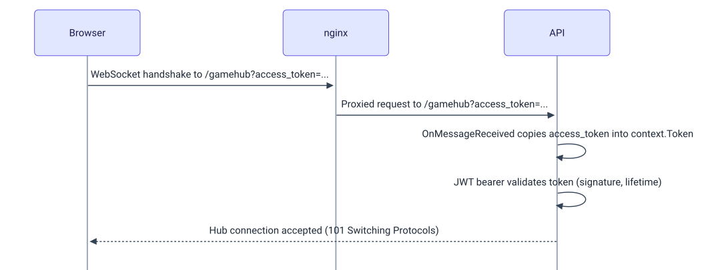

# API layer

The Api project (`TypeRacerServer.csproj`, folder `TypeRacerServer/Api`) is the entry point of the backend. It hosts the REST controllers and the SignalR hub, wires up authentication and the middleware pipeline, and connects the Core project (folders `Domain/` and `Application/` inside `TypeRacerServer/Core`) with the Infrastructure project (`TypeRacerServer/Infrastructure`).

## Project layout

```
TypeRacerServer/Api
├── Program.cs
├── GameHub.cs
├── Controllers/
│   ├── LoginController.cs
│   ├── RegisterController.cs
│   ├── Leaderboard.cs
│   └── SaveScoreController.cs
├── Extensions/
│   └── AddAuthentication.cs
├── Middlewares/
│   ├── PerformanceLoggerMiddleware.cs
│   └── RateLimiterMiddleware.cs
├── appsettings.Development.json
├── appsettings.json            (git-ignored, local only)
└── TypeRacerServer.csproj
```

[`TypeRacerServer.csproj`](../../TypeRacerServer/Api/TypeRacerServer.csproj) uses the `Microsoft.NET.Sdk.Web` SDK targeting `net10.0`. Its package references are `BCrypt.Net-Next`, `Microsoft.AspNetCore.Authentication.JwtBearer`, `Microsoft.EntityFrameworkCore.Design`, `Microsoft.EntityFrameworkCore.Tools` and `Npgsql.EntityFrameworkCore.PostgreSQL`. It carries `ProjectReference`s to the Infrastructure project and the Core project.

## Startup (Program.cs)

[`Program.cs`](../../TypeRacerServer/Api/Program.cs) follows this order:

1. **Configuration read.** `builder.Configuration["JwtSettings:Key"]` is read first; if it is null or empty, startup throws an `Exception("No jwt key")`. The Npgsql connection string is read later from `ConnectionStrings:DefaultConnection`.
2. **Service registration**, in code order:
   - `AddAuthenticationCustom(jwtkey)` — JWT bearer authentication, defined in the Extensions folder (see [Authentication](#authentication)).
   - `AddAuthorization()`.
   - `AddDbContext<AppDbContext>` using `UseNpgsql` with the `DefaultConnection` connection string.
   - `AddSignalR()`.
   - `AddControllers()`.
   - Four repository registrations as `Scoped` services (`ILoginRepository`/`LoginRepository`, `IRegisterRepository`/`RegisterRepository`, `ILeaderboardRepository`/`LeaderboardRepository`, `ISaveScoreRepository`/`SaveScoreRepository`).
   - `AddCors` with a policy named `ReactPolicy`, allowing origin `http://localhost:3000` with any header, any method and credentials.
   - `AddCoreServices()`, an extension defined in the Core project (`TypeRacerServer/Core/Domain/Dependency/DependencyInjection.cs`) that registers the Core application services and their interfaces.
3. **Pipeline setup** (see [Request pipeline](#request-pipeline)).
4. **Database initialization.** Inside a `using (var scope = app.Services.CreateScope())` block, the app resolves `AppDbContext` and calls `dbContext.Database.EnsureCreated()`.
5. `app.Run()`.

Locally, configuration values come from `appsettings.json` / `appsettings.Development.json`. In Docker, the root [`docker-compose.yml`](../../docker-compose.yml) supplies them as environment variables `ConnectionStrings__DefaultConnection` and `JwtSettings__Key`, using ASP.NET Core's double-underscore configuration binding convention.

### DI registrations made in the Api project

| Service | Implementation / source | Lifetime |
|---|---|---|
| JWT Bearer authentication | `AddAuthenticationCustom` (Extensions/AddAuthentication.cs) | Authentication scheme (singleton-managed by the framework) |
| Authorization | `AddAuthorization()` | Framework-managed |
| `AppDbContext` | Npgsql, `ConnectionStrings:DefaultConnection` | Scoped (EF Core default) |
| SignalR | `AddSignalR()` | Framework-managed |
| Controllers | `AddControllers()` | Framework-managed |
| `ILoginRepository` | `LoginRepository` | Scoped |
| `IRegisterRepository` | `RegisterRepository` | Scoped |
| `ILeaderboardRepository` | `LeaderboardRepository` | Scoped |
| `ISaveScoreRepository` | `SaveScoreRepository` | Scoped |
| CORS policy `ReactPolicy` | origin `http://localhost:3000`, any header/method, credentials allowed | Framework-managed |
| Core services | `AddCoreServices()` (Core project) | Defined in Core, see [`core-layer.md`](core-layer.md) |

## Request pipeline

The following diagram shows the middleware order as registered in `Program.cs`.

<picture>
  <source media="(prefers-color-scheme: dark)" srcset="../diagrams/backend-api-layer-01-request-pipeline.dark.svg">
  
</picture>

- **CORS (`ReactPolicy`)** runs first and allows requests from `http://localhost:3000`.
- **`PerformanceLoggerMiddleware`** wraps the rest of the pipeline in a `Stopwatch` and logs an informational message ("Request took {ElapsedMilliseconds} ms") when a request takes more than 500 ms, read from [`PerformanceLoggerMiddleware.cs`](../../TypeRacerServer/Api/Middlewares/PerformanceLoggerMiddleware.cs).
- **Authentication** (`UseAuthentication()`) validates the JWT bearer token.
- **Authorization** (`UseAuthorization()`) enforces `[Authorize]` attributes, such as the one on `GameHub`.
- **Endpoints** are either the mapped controllers (`MapControllers()`) or the SignalR hub mapped at `/gamehub` (`MapHub<GameHub>("/gamehub")`).

`RateLimiterMiddleware` ([`RateLimiterMiddleware.cs`](../../TypeRacerServer/Api/Middlewares/RateLimiterMiddleware.cs)) is defined as an extension `CustomRateLimiting` that registers a fixed-window limiter under the policy name `RateLimiter`, but its registration (`builder.Services.CustomRateLimiting()`) and the corresponding `app.UseRateLimiter()` call are both commented out in `Program.cs`. Independently of this, `LoginController` and `RegisterController` carry an `[EnableRateLimiting("AntiSpamPolicy")]` attribute, which refers to a policy name that is not registered anywhere in the reviewed code.

## Authentication

[`Api/Extensions/AddAuthentication.cs`](../../TypeRacerServer/Api/Extensions/AddAuthentication.cs) configures JWT Bearer as the default authentication scheme (`JwtBearerDefaults.AuthenticationScheme`). Its `TokenValidationParameters`:

| Parameter | Value |
|---|---|
| `ValidateIssuer` | `false` |
| `ValidateAudience` | `false` |
| `ValidateLifetime` | `true` |
| `ValidateIssuerSigningKey` | `true` |
| `IssuerSigningKey` | Symmetric key built from `JwtSettings:Key` |

`RequireHttpsMetadata` is set to `false`. Two JWT bearer events are registered:

- `OnMessageReceived` reads `access_token` from the request query string and, when the request path starts with `/gamehub`, copies it into `context.Token`. This is needed because browsers cannot set custom headers on WebSocket handshake requests, so the SignalR client sends the token as a query parameter instead.
- `OnAuthenticationFailed` writes the exception message to the console.

Token issuance itself (validating credentials and producing the JWT) happens in Core's `LoginService`, not in the Api project — see [`core-layer.md`](core-layer.md).

The sequence below shows where the token is validated for a hub connection carrying `?access_token=`.

<picture>
  <source media="(prefers-color-scheme: dark)" srcset="../diagrams/backend-api-layer-02-authentication.dark.svg">
  
</picture>

## Controllers

All four controllers in `Controllers/` follow the same conventions: `[ApiController]`, `[Route("api/[controller]")]`, a Core service injected through the primary constructor, and a thin action method that calls exactly one Core service method and returns `Ok(...)`. `Leaderboard.cs` names its class `Leaderboard`, without the usual `Controller` suffix. `SaveScoreController` reads the caller's username from `HttpContext.User.Identity?.Name` (the claim set by the JWT bearer authentication) rather than from the request body.

| Controller class | Route | Core service used |
|---|---|---|
| `LoginController` | `api/Login` | `LoginService` |
| `RegisterController` | `api/Register` | `RegisterService` |
| `Leaderboard` | `api/Leaderboard` | `LeaderboardSerivce` |
| `SaveScoreController` | `api/SaveScore` | `SaveScoreService` |

Request and response contracts for each endpoint are documented in [`endpoints.md`](endpoints.md).

## GameHub

[`GameHub.cs`](../../TypeRacerServer/Api/GameHub.cs) is decorated with `[Authorize]` and mapped at `/gamehub`. It uses a primary constructor to inject `IHubContext<GameHub>` and eight Core services: `JoinRoomService`, `StartRoomGameService`, `PerformCleanupService`, `SendProgressService`, `PowerUpService`, `RestartGameService`, `ChangeRoomSettingsService`, `EndGameProcessService`.

The hub acts as an adapter between SignalR and Core: each hub method extracts the caller's nickname from `Context.User?.Identity?.Name`, calls exactly one Core service, receives back a plain result record, and translates that result into `Clients.Caller`, `Clients.Group(roomCode)` or `Clients.Client(connectionId)` calls. Rooms are SignalR groups named after the room code; a session is the per-connection player state keyed by `Context.ConnectionId`.

Two hub methods start background work with `Task.Run` and call the injected `IHubContext<GameHub>` instead of the hub's own `Clients` property, because the hub instance is disposed as soon as the triggering invocation returns, while the `Task.Run` continuation keeps running afterwards:

- `OnDisconnectedAsync` waits 15 seconds (`Task.Delay(15000)`) before running cleanup, to tolerate short reconnects.
- `SendProgress` can schedule a delayed end-of-game (`Task.Delay(1000 * result.SecondsToEnd)`) when the result indicates the timer should start.

The diagram below traces one hub method, `SendProgress`, through this adapter pattern.

<picture>
  <source media="(prefers-color-scheme: dark)" srcset="../diagrams/backend-api-layer-03-gamehub.dark.svg">
  
</picture>

| Hub method | Core service |
|---|---|
| `JoinRoom` | `JoinRoomService` |
| `StartRoomGame` | `StartRoomGameService` |
| `OnDisconnectedAsync` | `PerformCleanupService` |
| `SendProgress` | `SendProgressService` |
| `UsePowerUp` | `PowerUpService` |
| `RestartGame` | `RestartGameService` |
| `ChangeRoomSettings` | `ChangeRoomSettingsService` |
| `ExecuteEndGame` (private, called from `SendProgress`) | `EndGameProcessService` |

Event names, payload shapes and message contracts for each hub method are documented in [`endpoints.md`](endpoints.md).

## Related documents

- [`README.md`](README.md) — backend overview.
- [`endpoints.md`](endpoints.md) — REST endpoint and SignalR event contracts.
- [`core-layer.md`](core-layer.md) — Core project services, including `LoginService` token issuance.
- [`infrastructure-layer.md`](infrastructure-layer.md) — repositories and `AppDbContext`.
- [`../architecture.md`](../architecture.md) — overall system architecture.
