# Core layer

The Core layer is a single assembly, `Core.csproj`, holding the entities, value objects, constants and in-memory game state of the `Domain/` folder together with the application services, interfaces and result records (`Application/`). Both the Api project and the Infrastructure project reference it, and it owns every game rule described in this document. Core never talks to a database or a network directly; it depends only on the repository interfaces it declares itself, which Infrastructure implements.

## Layout

```text
TypeRacerServer/Core/
├── Domain/
│   ├── Constant/
│   │   ├── PowerUp.cs           PowerUp.PowerUps: "freeze", "flashbang", "chaos", "bomb"
│   │   ├── Buffs.cs             Buffs.Buff: "shield"
│   │   └── GameQuotes.cs        GameQuotes.Quotes: 52 code snippets to type
│   ├── Dependency/
│   │   └── DependencyInjection.cs   AddCoreServices() composition root
│   ├── Enitites/
│   │   └── User.cs              namespace TypeRacerServer.Core.Domain.Entities
│   ├── State/
│   │   └── GameState.cs         in-memory Rooms and Sessions dictionaries
│   └── ValueObjects/
│       ├── Username.cs
│       └── Password.cs
└── Application/
    ├── Interfaces/
    │   ├── AccountManagerInterfaces/
    │   │   ├── ILoginRepository.cs
    │   │   └── IRegisterRepository.cs
    │   ├── LeaderboardInterfaces/
    │   │   └── ILeadrboardRepository.cs     declares interface ILeaderboardRepository
    │   └── SavingStatsInterfaces/
    │       └── ISaveScoreRepository.cs
    ├── Models/
    │   ├── PlayerData/
    │   │   ├── PlayerSession.cs
    │   │   └── TopPlayers.cs
    │   ├── RoomResults/
    │   │   ├── RoomState.cs
    │   │   └── JoinRoomResult.cs
    │   ├── PreGameResults/
    │   │   └── StartRoomGameResult.cs
    │   └── PostGameResults/
    │       ├── SendProgressResult.cs
    │       ├── RestartGameResult.cs
    │       └── PerformCleanupResult.cs
    ├── Requests/
    │   ├── AccountManager/
    │   │   ├── LoginRequest.cs
    │   │   └── RegisterRequestByMe.cs
    │   └── SavingStats/
    │       └── SaveScoreRequest.cs
    └── Services/
        ├── AccountManager/
        │   ├── LoginService.cs
        │   └── RegisterService.cs
        ├── GameManager/
        │   └── UsePowerUpService.cs         defines class PowerUpService
        ├── LeaderboardManager/
        │   ├── LeaderboardService.cs         defines class LeaderboardSerivce
        │   └── SendProgressService.cs
        ├── PostGameManager/
        │   ├── EndGameProcessService.cs
        │   ├── PerformCleanupService.cs
        │   └── SaveScoreService.cs
        └── RoomManager/
            ├── ChangeRoomSettingsService.cs
            ├── JoinRoomService.cs
            ├── RestartGameService.cs
            └── StartRoomGameService.cs
```

The `Domain/Enitites` folder is spelled that way in the repository, but the C# namespace it declares is `TypeRacerServer.Core.Domain.Entities` (see [`User.cs`](../../TypeRacerServer/Core/Domain/Enitites/User.cs)). Likewise the interface file [`ILeadrboardRepository.cs`](../../TypeRacerServer/Core/Application/Interfaces/LeaderboardInterfaces/ILeadrboardRepository.cs) declares `interface ILeaderboardRepository`, and the service file [`LeaderboardService.cs`](../../TypeRacerServer/Core/Application/Services/LeaderboardManager/LeaderboardService.cs) declares `class LeaderboardSerivce`. Identifiers throughout this document are quoted exactly as they appear in the code.

## Domain model

[`User`](../../TypeRacerServer/Core/Domain/Enitites/User.cs) is a plain class with `int Id`, `required Username Username`, `required Password PasswordHash`, and three `uint` counters: `HighScoreWpm`, `GamesPlayed`, `GamesWin` (all default to `0`).

[`Username`](../../TypeRacerServer/Core/Domain/ValueObjects/Username.cs) and [`Password`](../../TypeRacerServer/Core/Domain/ValueObjects/Password.cs) are records that wrap a single `string Value`. Both constructors throw `ArgumentException` when the input is `null` or whitespace, and both define implicit conversions to and from `string`, so a plain string literal can be assigned directly to a `Username` or `Password` property. `Password.Value` holds the BCrypt hash produced by `BCrypt.Net.BCrypt.HashPassword`, not the plaintext password; the plaintext only exists transiently inside `RegisterService` and `LoginService`.

[`PowerUp.PowerUps`](../../TypeRacerServer/Core/Domain/Constant/PowerUp.cs) is a fixed `string[]` of four power-up names: `freeze`, `flashbang`, `chaos`, `bomb`. [`Buffs.Buff`](../../TypeRacerServer/Core/Domain/Constant/Buffs.cs) is a fixed `string[]` with a single buff, `shield`. [`GameQuotes.Quotes`](../../TypeRacerServer/Core/Domain/Constant/GameQuotes.cs) is a fixed `string[]` of 52 code snippets; one of them is picked at random as the text a room has to type.

A diagram of the entity and its two value objects:

<picture>
  <source media="(prefers-color-scheme: dark)" srcset="../diagrams/backend-core-layer-01-domain-model.dark.svg">
  
</picture>

## In-memory game state

[`GameState`](../../TypeRacerServer/Core/Domain/State/GameState.cs) holds two `ConcurrentDictionary` fields and nothing else: `Rooms` keyed by room code (the value the client calls "host code") and `Sessions` keyed by the SignalR `ConnectionId`. `GameState` is registered as a singleton in `DependencyInjection.cs`, so every request and every hub connection shares the same instance for the lifetime of the process; nothing is persisted to a database.

[`RoomState`](../../TypeRacerServer/Core/Application/Models/RoomResults/RoomState.cs) is a record describing one room: `TargetText` (the text currently being typed), `Players` (a `ConcurrentDictionary<string, string>` mapping ConnectionId to nickname), `GameStarted`, `HostConnection` (the ConnectionId of the host), `PowerUpsEnabled`, `SecondsToEnd` (countdown length once the first player finishes), `HardMode`, and `CurrentGameId` (a fresh `Guid` per room, reassigned each time a game starts).

[`PlayerSession`](../../TypeRacerServer/Core/Application/Models/PlayerData/PlayerSession.cs) is a record describing one connection's state within a room: `Nickname`, `RoomCode`, `TargetText`, `Progress` (percent), `PowerUpProgress` (correct-character count last checked for power-up thresholds), `Keystrokes`, `Errors`, `DebuffsReceived`, `StartTime`, `FinishTime`, `FreezeEnd`, and the computed property `Accuracy`, which returns `((Keystrokes - Errors) / Keystrokes) * 100.0` or `0` when `Keystrokes` is `0`.

<picture>
  <source media="(prefers-color-scheme: dark)" srcset="../diagrams/backend-core-layer-02-in-memory-game-state.dark.svg">
  
</picture>

## Application services

Every service follows the same convention: a public class with one public method that implements a single use case, constructor-injected with `GameState` and/or a repository interface, returning either a dedicated result record or a plain value (`bool`, `string`, a list). None of the services reference SignalR types or ASP.NET Core HTTP types; the Api project's `GameHub` and controllers translate results into hub messages or HTTP responses.

| Service class | Public method | Dependencies | Result type | Responsibility |
|---|---|---|---|---|
| [`JoinRoomService`](../../TypeRacerServer/Core/Application/Services/RoomManager/JoinRoomService.cs) | `JoinRoom` | `GameState` | `JoinRoomResult` | Adds or reconnects a player to a room, creating the room on first join. |
| [`StartRoomGameService`](../../TypeRacerServer/Core/Application/Services/RoomManager/StartRoomGameService.cs) | `StartRoomGame` | `GameState` | `StartRoomGameResult` | Starts a room's game for the host and resets every session's run state. |
| [`ChangeRoomSettingsService`](../../TypeRacerServer/Core/Application/Services/RoomManager/ChangeRoomSettingsService.cs) | `ChangeRoomSettings` | `GameState` | `bool` | Lets the host update `PowerUpsEnabled`, `HardMode` and `SecondsToEnd`. |
| [`RestartGameService`](../../TypeRacerServer/Core/Application/Services/RoomManager/RestartGameService.cs) | `RestartGame` | `GameState` | `RestartGameResult` | Lets the host return a finished room to the lobby state. |
| [`SendProgressService`](../../TypeRacerServer/Core/Application/Services/LeaderboardManager/SendProgressService.cs) | `SendProgress` | `GameState` | `SendProgressResult` | Applies one typed-input update: progress, WPM, errors, power-up/buff grants, hard-mode elimination, end-of-game triggers. |
| [`PowerUpService`](../../TypeRacerServer/Core/Application/Services/GameManager/UsePowerUpService.cs) | `PowerUp` | `GameState` | `bool` (with `out string targetID`) | Applies a power-up effect from one player against a named target. |
| [`LeaderboardSerivce`](../../TypeRacerServer/Core/Application/Services/LeaderboardManager/LeaderboardService.cs) | `Leaderboard` | `ILeaderboardRepository` | `List<TopPlayers>` | Maps top users to leaderboard rows and computes win rate. |
| [`EndGameProcessService`](../../TypeRacerServer/Core/Application/Services/PostGameManager/EndGameProcessService.cs) | `EndGameProcess` | `GameState` | `string` | Ranks a room's players and returns the winner's nickname (or a sentinel string). |
| [`PerformCleanupService`](../../TypeRacerServer/Core/Application/Services/PostGameManager/PerformCleanupService.cs) | `PerformCleanup` | `GameState` | `PerformCleanupResult` | Removes a disconnecting or leaving player, reassigns the host, deletes an empty room. |
| [`SaveScoreService`](../../TypeRacerServer/Core/Application/Services/PostGameManager/SaveScoreService.cs) | `SaveScoreHandler` | `ISaveScoreRepository` | `Task` | Updates a user's game-played/win/high-score counters after a game. |
| [`LoginService`](../../TypeRacerServer/Core/Application/Services/AccountManager/LoginService.cs) | `LoginHandler` | `ILoginRepository`, `IConfiguration` | `Task<string>` | Verifies credentials with BCrypt and issues a JWT. |
| [`RegisterService`](../../TypeRacerServer/Core/Application/Services/AccountManager/RegisterService.cs) | `RegisterHandler` | `IRegisterRepository` | `Task` | Rejects a taken username, then saves a new account with a BCrypt password hash. |

### Result records

[`SendProgressResult`](../../TypeRacerServer/Core/Application/Models/PostGameResults/SendProgressResult.cs) is the richest result: it carries `Progress` (percent), `Wpm`, `HasError`, `IsSuccess`, `IsDone`, `PowerUpGrant` and `BuffToGrant` (names from `PowerUp.PowerUps` / `Buffs.Buff`, or `null`), `TriggerHardModeFail`, `ShouldEndGameImmediately`, `ShouldStartEndGameTimer`, `SecondsToEnd`, `RoomCode`, and `PlayerNick`. `GameHub` (see [API layer](api-layer.md)) reads these flags after every `SendProgress` call to decide which SignalR events to broadcast to the room — a progress update, a power-up/buff grant, a hard-mode elimination, or one of the two end-of-game triggers.

## Game rules

**Joining** ([`JoinRoomService.JoinRoom`](../../TypeRacerServer/Core/Application/Services/RoomManager/JoinRoomService.cs)): the room is fetched or created with `Rooms.GetOrAdd(HostCode, ...)`. If `room.Players.Count == 0`, the joining connection becomes `HostConnection` and the result is flagged `NeedsLobbySetup`. Before that, the service looks for an existing session with the same `Nickname` and `RoomCode`; if one exists, it is treated as a reconnect — the session is removed under the old ConnectionId and re-added under the new one (`Sessions.TryRemove` + `Sessions.TryAdd`), and `HostConnection` is updated if the reconnecting player was the host. Joining a room where `GameStarted` is `true` is rejected (`isSucces = false`) unless the player is reconnecting.

**Starting** ([`StartRoomGameService.StartRoomGame`](../../TypeRacerServer/Core/Application/Services/RoomManager/StartRoomGameService.cs)): fails silently (returns a default `StartRoomGameResult`) unless the caller's ConnectionId matches `room.HostConnection` and the room is not already started. On success it picks a random entry from `GameQuotes.Quotes`, assigns a new `CurrentGameId`, sets `GameStarted = true`, and resets every player session in the room (`TargetText`, `Progress`, `Errors`, `Keystrokes`, `DebuffsReceived`, `FinishTime`, `StartTime`, `PowerUpProgress`).

**Progress** ([`SendProgressService.SendProgress`](../../TypeRacerServer/Core/Application/Services/LeaderboardManager/SendProgressService.cs)): a frozen player (`FreezeEnd` in the future), an already-finished player (`FinishTime` set), or a player with no `TargetText` is ignored and gets back a default result. Otherwise `StartTime` is set on the first character typed. The service walks `currentInput` and `TargetText` in lockstep to find the correct-prefix length; any extra characters beyond that prefix count as an error. `Progress` is `(correctLength * 100) / TargetText.Length`. WPM is `(correctChars / 5.0) / (elapsedSeconds / 60.0)`, computed only once `StartTime` is set; a result above 300 WPM is discarded (the method returns the default, unsuccessful result instead).

**Power-ups** (only when `room.PowerUpsEnabled`): the service tracks the highest correct-prefix length reached so far in `PowerUpProgress`, and only evaluates thresholds when a new high is reached. A power-up is granted when `correctLength % 5 == 0`; a buff is granted when `correctLength % 10 == 0` (so every second power-up threshold also grants a buff). [`PowerUpService.PowerUp`](../../TypeRacerServer/Core/Application/Services/GameManager/UsePowerUpService.cs) applies a granted power-up against a named target: it increments the target's `DebuffsReceived`, and for `freeze` sets `FreezeEnd = DateTime.Now.AddSeconds(3)`. Other power-up and buff effects (`flashbang`, `chaos`, `bomb`, `shield`) carry no server-side logic beyond the grant and are rendered client-side.

**Hard mode** (`room.HardMode`): the first error a player makes clears their `TargetText` to an empty string, which eliminates them from further progress updates (`SendProgress` returns early for players with an empty `TargetText`). Once no player in the room still has a non-empty `TargetText` and unfinished status, the game ends immediately.

**Finishing**: when a player's `currentInput` equals `TargetText`, `FinishTime` is set. If this is the first finisher in the room, either the game ends immediately (`room.SecondsToEnd == 0`) or the `SecondsToEnd` countdown starts (`ShouldStartEndGameTimer`); once every active player has finished, the game ends immediately regardless of the countdown.

**End of game** ([`EndGameProcessService.EndGameProcess`](../../TypeRacerServer/Core/Application/Services/PostGameManager/EndGameProcessService.cs)): sets `room.GameStarted = false`, then ranks the room's sessions by `Progress` descending, `FinishTime` ascending (unfinished players sort last, via `DateTime.MaxValue`), `Accuracy` descending, `DebuffsReceived` descending, and `Nickname` ascending (a final `Guid.NewGuid()` tiebreak covers any remaining ties). The top-ranked player's nickname is returned as the winner. In hard mode, if that top player's `TargetText` is empty (meaning even the "winner" was eliminated), the method returns `"No survivors"` instead. If the room has no players at all, it returns `"None"`.

**Cleanup** ([`PerformCleanupService.PerformCleanup`](../../TypeRacerServer/Core/Application/Services/PostGameManager/PerformCleanupService.cs)): removes the disconnecting connection's session and its room-player entry; if it was the host, hands `HostConnection` to the next remaining player (or an empty string if none remain); deletes the room entirely once `Players.Count` reaches `0`.

| Constant | Value | Where |
|---|---|---|
| Power-up grant interval | every 5 correct characters | `SendProgressService.SendProgress` |
| Buff grant interval | every 10 correct characters | `SendProgressService.SendProgress` |
| Freeze duration | 3 seconds | `PowerUpService.PowerUp` |
| WPM discard threshold | above 300 WPM | `SendProgressService.SendProgress` |
| WPM formula | `(correctChars / 5) / elapsedMinutes` | `SendProgressService.SendProgress` |
| `GameQuotes.Quotes` length | 52 entries | `GameQuotes.cs` |

## Dependency injection

[`AddCoreServices`](../../TypeRacerServer/Core/Domain/Dependency/DependencyInjection.cs) is an `IServiceCollection` extension method that registers every Core service:

| Registration | Lifetime |
|---|---|
| `GameState` | Singleton |
| `LoginService` | Scoped |
| `RegisterService` | Scoped |
| `JoinRoomService` | Transient |
| `ChangeRoomSettingsService` | Transient |
| `RestartGameService` | Transient |
| `StartRoomGameService` | Transient |
| `PowerUpService` | Transient |
| `LeaderboardSerivce` | Transient |
| `SendProgressService` | Transient |
| `EndGameProcessService` | Transient |
| `PerformCleanupService` | Transient |
| `SaveScoreService` | Transient |

This composition root lives in `Domain/Dependency/`, not in `Application/`, and it references types from every `Application/Services/*` subfolder to register them. In the other direction, `Domain/State/GameState.cs` imports `TypeRacerServer.Core.Application.Models.PlayerData` and `...Models.RoomResults` so that `Rooms` and `Sessions` can be typed against `RoomState` and `PlayerSession`. So while `Domain/` and `Application/` are separate folders, they reference each other rather than forming a strict one-way layering.

## Tests

[`TypeRacerServer/Core.Tests`](../../TypeRacerServer/Core.Tests/Core.Tests.csproj) is an xUnit + Moq project referencing `Core.csproj`. Besides the generated placeholder `UnitTest1`, it contains:

| Test class | Covers |
|---|---|
| [`LoginServiceTests`](../../TypeRacerServer/Core.Tests/Application/Services/AccountManager/LoginServiceTests.cs) | `LoginService.LoginHandler`: user-not-found, wrong-password, and successful JWT issuance. |
| [`RegisterServiceTests`](../../TypeRacerServer/Core.Tests/Application/Services/AccountManager/RegisterServiceTests.cs) | `RegisterService.RegisterHandler`: rejecting a taken username, saving a new account. |
| [`UsePowerupServiceTests`](../../TypeRacerServer/Core.Tests/Application/Services/GameManager/UsePowerupServiceTests.cs) | `PowerUpService.PowerUp`: successful use, wrong room, unknown nickname. |
| [`LeaderboardServiceTests`](../../TypeRacerServer/Core.Tests/Application/Services/LeaderboardManager/LeaderboardServiceTests.cs) | `LeaderboardSerivce.Leaderboard`: mapping users to `TopPlayers` and computing win rate. |
| [`SendProgressServiceTests`](../../TypeRacerServer/Core.Tests/Application/Services/LeaderboardManager/SendProgressServiceTests.cs) | `SendProgressService.SendProgress`: normal progress/keystroke updates, hard-mode elimination, finishing a text and triggering the end-of-game path. |
| [`EndGameProcessServiceTests`](../../TypeRacerServer/Core.Tests/Application/Services/PostGameManager/EndGameProcessServiceTests.cs) | `EndGameProcessService.EndGameProcess`: tie-breaking equal progress by faster finish time. |
| [`SaveScoreServiceTests`](../../TypeRacerServer/Core.Tests/Application/Services/PostGameManager/SaveScoreServiceTests.cs) | `SaveScoreService.SaveScoreHandler`: empty username, user not found, updating stats on a win with a new high score. |
| [`ChangeRoomServiceTests`](../../TypeRacerServer/Core.Tests/Application/Services/RoomManager/ChangeRoomServiceTests.cs) | `ChangeRoomSettingsService.ChangeRoomSettings`: an unknown room and a caller who is not the host both return `false`. |
| [`JoinRoomServiceTests`](../../TypeRacerServer/Core.Tests/Application/Services/RoomManager/JoinRoomServiceTests.cs) | `JoinRoomService.JoinRoom`: first player becomes host, joining a started room fails, an existing player reconnects with a swapped ConnectionId. |
| [`RestartGameServiceTests`](../../TypeRacerServer/Core.Tests/Application/Services/RoomManager/RestartGameServiceTests.cs) | `RestartGameService.RestartGame`: the host resets all players, a non-host request does nothing. |
| [`StartRoomGameServiceTests`](../../TypeRacerServer/Core.Tests/Application/Services/RoomManager/StartRoomGameServiceTests.cs) | `StartRoomGameService.StartRoomGame`: a non-host request fails; the host success case is an empty `//TODO` placeholder. |

## Related documents

- [Backend overview](README.md)
- [API layer](api-layer.md)
- [Endpoints and SignalR contract](endpoints.md)
- [Infrastructure layer](infrastructure-layer.md)
- [Architecture](../architecture.md)
