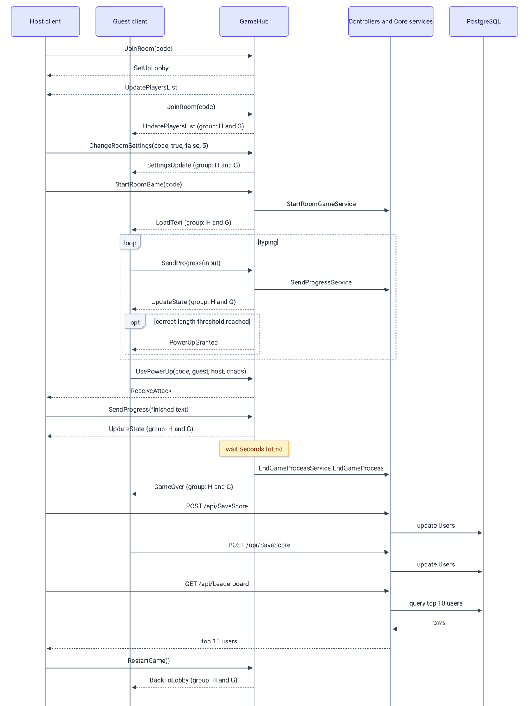

# Endpoints and SignalR contract

This page lists the complete client-facing contract of the backend: four REST endpoints under `/api` and the SignalR hub at `/gamehub`. All routes live in the Api project (`TypeRacerServer.csproj`, folder `TypeRacerServer/Api`); the request and response shapes are defined by DTOs and services in the Core project (folders `Domain/` and `Application/` inside `TypeRacerServer/Core`), and are consumed by the client (React SPA in `typeracer-client`). In the Docker setup (`docker-compose.yml`) both `/api` and `/gamehub` are reached through nginx on port 3000. JSON is (de)serialized with ASP.NET Core defaults (camelCase property names, case-insensitive property binding), and MVC routing is case-insensitive, so `/api/login` and `/api/Login` both resolve.

## Authentication

`POST /api/Login` issues a JWT, signed with HS256 using the key from `JwtSettings:Key`. The token carries a single claim, `ClaimTypes.Name` set to the username, and expires 3 days after issuance. Token creation happens in [`LoginService.cs`](../../TypeRacerServer/Core/Application/Services/AccountManager/LoginService.cs).

REST calls that need identity send `Authorization: Bearer <token>`. The SignalR hub receives the same token differently depending on the leg of the connection:

- The JavaScript SignalR client (`typeracer-client/src/GameLogic.js`) sends the token as an `Authorization: Bearer` header on the `POST /gamehub/negotiate` request, exactly like a REST call.
- Browsers cannot set custom headers on a WebSocket handshake, so for the following WebSocket upgrade the client appends the token as an `access_token` query string parameter instead.
- On the server, [`AddAuthentication.cs`](../../TypeRacerServer/Api/Extensions/AddAuthentication.cs) reads that query parameter in `OnMessageReceived` for any request path starting with `/gamehub`, and uses it as the bearer token for that connection.

Two client-facing pieces require an authenticated caller, but not in the same way:

- `GameHub` carries a class-level `[Authorize]` attribute: every hub method requires a valid JWT.
- `SaveScoreController` has no `[Authorize]` attribute. It reads the username from `HttpContext.User.Identity?.Name` and throws `InvalidOperationException` if that value is null, which happens when no valid token was sent.

`RegisterController` and `LoginController` both carry `[EnableRateLimiting("AntiSpamPolicy")]`, but the corresponding rate limiter registration and `app.UseRateLimiter()` call are commented out in [`Program.cs`](../../TypeRacerServer/Api/Program.cs), so the attribute currently has no effect.

## REST endpoints

| Method | Route | Auth | Controller class | Core service |
|---|---|---|---|---|
| `POST` | `/api/Register` | none | [`RegisterController`](../../TypeRacerServer/Api/Controllers/RegisterController.cs) | [`RegisterService`](../../TypeRacerServer/Core/Application/Services/AccountManager/RegisterService.cs) |
| `POST` | `/api/Login` | none | [`LoginController`](../../TypeRacerServer/Api/Controllers/LoginController.cs) | [`LoginService`](../../TypeRacerServer/Core/Application/Services/AccountManager/LoginService.cs) |
| `GET` | `/api/Leaderboard` | none | [`Leaderboard`](../../TypeRacerServer/Api/Controllers/Leaderboard.cs) | [`LeaderboardSerivce`](../../TypeRacerServer/Core/Application/Services/LeaderboardManager/LeaderboardService.cs) |
| `POST` | `/api/SaveScore` | Bearer token (read from `HttpContext.User.Identity?.Name`, no `[Authorize]` attribute) | [`SaveScoreController`](../../TypeRacerServer/Api/Controllers/SaveScoreController.cs) | [`SaveScoreService`](../../TypeRacerServer/Core/Application/Services/PostGameManager/SaveScoreService.cs) |

No exception-handling middleware is registered, so exceptions thrown by Core services surface as HTTP 500 responses.

### POST /api/Register

Request body maps to [`RegisterRequestByMe`](../../TypeRacerServer/Core/Application/Requests/AccountManager/RegisterRequestByMe.cs):

```json
{
  "username": "alice",
  "password": "hunter2"
}
```

Response: `200 OK` with an empty body.

| Status | Condition |
|---|---|
| `200` | Registration succeeded |
| `400` | Malformed request JSON (`[ApiController]` automatic model validation) |
| `500` | `RegisterService.RegisterHandler` throws `InvalidOperationException("Username already exists")` when the username is already taken |

### POST /api/Login

Request body maps to [`LoginRequest`](../../TypeRacerServer/Core/Application/Requests/AccountManager/LoginRequest.cs):

```json
{
  "username": "alice",
  "password": "hunter2"
}
```

Response `200 OK`:

```json
{
  "token": "eyJhbGciOiJIUzI1NiIsInR5cCI6IkpXVCJ9..."
}
```

`LoginController` returns an anonymous object with a `Token` property; System.Text.Json serializes it to `token`. The client reads `data.token || data.Token` (`typeracer-client/src/Auth.js`) to tolerate either casing, although the server only ever emits `token`.

| Status | Condition |
|---|---|
| `200` | Credentials valid, token returned |
| `400` | Malformed request JSON |
| `500` | `LoginService.LoginHandler` throws a plain `Exception` for an unknown username (`"User not found"`) or a wrong password (`"Wrong password"`); an empty or whitespace password also throws (`ArgumentException` from the `Password` value object, [`Password.cs`](../../TypeRacerServer/Core/Domain/ValueObjects/Password.cs)) before the credential check runs |

### GET /api/Leaderboard

No request body, no authentication.

Response `200 OK`, an array of [`TopPlayers`](../../TypeRacerServer/Core/Application/Models/PlayerData/TopPlayers.cs):

```json
[
  {
    "username": "alice",
    "highScoreWpm": 87,
    "gamesPlayed": 12,
    "gamesWin": 8,
    "winrate": 66.7
  },
  {
    "username": "bob",
    "highScoreWpm": 74,
    "gamesPlayed": 5,
    "gamesWin": 0,
    "winrate": 0
  }
]
```

`LeaderboardRepository.GetTopUsers` (see [`LeaderboardRepository.cs`](../../TypeRacerServer/Infrastructure/Persistence/Repositories/LeaderboardRepository.cs)) returns at most 10 users, ordered by `GamesWin` descending, then `HighScoreWpm` descending. `LeaderboardSerivce.Leaderboard` maps each `User` to a `TopPlayers` record; when `GamesWin > 0` it computes `Winrate` as `GamesWin / GamesPlayed * 100`, rounded to one decimal, otherwise `Winrate` is `0`.

### POST /api/SaveScore

Request body maps to [`SaveScoreRequest`](../../TypeRacerServer/Core/Application/Requests/SavingStats/SaveScoreRequest.cs), which declares `Username`, `WPM` and `isWinner`:

```json
{
  "username": "alice",
  "wpm": 87,
  "isWinner": true
}
```

The `username` field in the body is accepted but not used: `SaveScoreController` takes the username from the JWT `Name` claim instead and passes it separately to `SaveScoreService.SaveScoreHandler`. The client (`typeracer-client/src/GameLogic.js`) sends the body with PascalCase keys (`Username`, `Wpm`, `IsWinner`), which still binds correctly because ASP.NET Core JSON model binding is case-insensitive.

Response: `200 OK` with an empty body.

| Status | Condition |
|---|---|
| `200` | Score saved |
| `400` | Malformed request JSON |
| `500` | No valid bearer token (`Identity?.Name` is null, `InvalidOperationException` thrown in the controller), or the username from the token has no matching row (`SaveScoreService` throws `Exception("User not found")`) |

## SignalR hub /gamehub

The client connects with `new HubConnectionBuilder().withUrl("/gamehub", { accessTokenFactory })` in [`GameLogic.js`](../../typeracer-client/src/GameLogic.js); `accessTokenFactory` reads the JWT from `localStorage` and strips any character outside `[a-zA-Z0-9_.-]`. Connecting happens in two HTTP legs:

1. `POST /gamehub/negotiate?negotiateVersion=1` with an `Authorization: Bearer <token>` header, handled by the SignalR JS client's internal HTTP client.
2. A WebSocket upgrade on `/gamehub?id=<connectionToken>&access_token=<token>`, where the token travels as a query parameter because the WebSocket handshake carries no custom headers.

Through nginx ([`nginx.conf`](../../typeracer-client/nginx.conf)), the `/gamehub` location forwards the `Upgrade` and `Connection` headers (via the `$connection_upgrade` map) so the WebSocket upgrade passes through to the backend container. `GameHub` carries `[Authorize]`, so both legs need a valid token.

Player identity inside the hub is `Context.User.Identity.Name` (the JWT `Name` claim). A room is a SignalR group named after the room code (the `HostCode`/`roomCode` parameter), joined with `Groups.AddToGroupAsync` in `JoinRoom`. A session is the per-connection player state keyed by `Context.ConnectionId`, held in the in-memory `GameState`.

### Client to server methods

All methods are defined in [`GameHub.cs`](../../TypeRacerServer/Api/GameHub.cs).

| Method | Core service | Return value | Who may call it effectively | Events triggered |
|---|---|---|---|---|
| `Task<bool> JoinRoom(string HostCode)` | `JoinRoomService.JoinRoom` | `true` on success; `false` when the room's game has already started and the caller has no earlier session in that room | any authenticated user; the first caller to join an empty room becomes the host | `SetUpLobby` (first joiner only), `UpdatePlayersList` (caller and rest of group), `LoadText` (caller only, on rejoin into a started game) |
| `Task StartRoomGame(string HostCode)` | `StartRoomGameService.StartRoomGame` | none (`Task`) | only effective when the caller's `ConnectionId` matches the room's `HostConnection` and the game has not started yet; the check happens inside `StartRoomGameService`, other callers are silently ignored | `LoadText` (whole group), only on success |
| `Task LeaveRoom()` | `PerformCleanupService.PerformCleanup` | none (`Task`) | any player with a session in a room; a caller without one is ignored. The caller is removed at once (no grace period) and taken out of the SignalR group; if the caller was the host, the first remaining player becomes the host | `UpdatePlayersList` (rest of the group), unless the room is left empty |
| `Task SendProgress(string currentInput)` | `SendProgressService.SendProgress` | none (`Task`) | any player with an active session and target text; a frozen or already-finished player's input is ignored | `PowerUpGranted` (caller), `ReceiveDefense` (caller), `ReceiveAttack` (group, hard-mode failure), `UpdateState` (group), `GameOver` (group, after a delay or immediately, once the round ends) |
| `Task UsePowerUp(string roomCode, string AttackerNick, string TargetNick, string Power)` | `PowerUpService.PowerUp` (class `PowerUpService`, defined in [`UsePowerUpService.cs`](../../TypeRacerServer/Core/Application/Services/GameManager/UsePowerUpService.cs)) | none (`Task`) | effective while the room's game is started and `TargetNick` matches a player currently in the room; `AttackerNick` is accepted as a parameter but is not passed to the service, so it is not checked | `ReceiveAttack` sent to `Client(targetID)` only |
| `Task RestartGame()` | `RestartGameService.RestartGame` | none (`Task`) | only effective when the caller's `ConnectionId` matches the room's `HostConnection`, checked inside `RestartGameService` | `BackToLobby` (group), only on success |
| `Task ChangeRoomSettings(string roomCode, bool powerUpsEnabled, bool hardMode, int secondsToEnd)` | `ChangeRoomSettingsService.ChangeRoomSettings` | none (`Task`) | only effective when the caller's `ConnectionId` matches the room's `HostConnection`, checked inside `ChangeRoomSettingsService` | `SettingsUpdate` (group), only on success |

### Server to client events

JSON casing below follows the anonymous objects as written in `GameHub.cs`; System.Text.Json camel-cases them on the wire (for example `PowerUpsEnabled` becomes `powerUpsEnabled`). The client's event handlers in `GameLogic.js` read the camelCase form, with a fallback to PascalCase for `SetUpLobby`, `SettingsUpdate`, `UpdatePlayersList` and `UpdateState` (the latter for `playerNick`, `progress`, `hasError`, `isDone` and `wpm`).

| Event | Recipients | Payload | Sent when |
|---|---|---|---|
| `SetUpLobby` | Caller | `{ PowerUpsEnabled: false, SecondsToEnd: 0, HardMode: false }` (hardcoded values) | `JoinRoom`, when the caller is the first player to join an empty room |
| `UpdatePlayersList` | Caller, then `GroupExcept` the caller (together, the whole group) | `{ Players: string[], Host: string }` | `JoinRoom`, after every successful join; `LeaveRoom`, to the remaining group; also from `OnDisconnectedAsync`, sent to the whole `Group` through `_hubContext` after a 15 second delay, if the disconnecting player is removed and the room is not left empty |
| `LoadText` | Caller (on rejoin) or `Group` (on start) | string, the race text | `JoinRoom`, when a rejoining player already has saved target text; `StartRoomGame`, to the whole group, at the start of a race |
| `UpdateState` | `Group` | `{ playerNick, progress, hasError, isDone, wpm }` | `SendProgress`, after every processed keystroke; also from `OnDisconnectedAsync`, with `playerNick = "Disconnected Player"`, only if the room's game had already started |
| `PowerUpGranted` | Caller | string, the power-up name | `SendProgress`, when power-ups are enabled for the room and the player's correct-character count reaches a new multiple of 5 |
| `ReceiveDefense` | Caller | `("auto", buff)`, two positional arguments | `SendProgress`, when power-ups are enabled for the room and the player's correct-character count reaches a new multiple of 10 |
| `ReceiveAttack` | `Client(targetID)` or `Group` | `(nick, power)`, two positional arguments | `UsePowerUp`, sent to the target connection with `(TargetNick, Power)`; also `SendProgress`, sent to the whole group with `(PlayerNick, "freeze")` on a hard-mode typing error |
| `BackToLobby` | `Group` | none | `RestartGame`, when the caller is the host |
| `SettingsUpdate` | `Group` | `{ powerUpsEnabled, hardMode, secondsToEnd }` | `ChangeRoomSettings`, when the caller is the host |
| `GameOver` | `Group` | string: the winner's nickname, `"None"` (no players found), or `"No survivors"` (hard mode, nobody left with target text) | End of a round, via the hub's private `ExecuteEndGame`, which calls `EndGameProcessService.EndGameProcess` |

### Power-up and buff values

Defined in [`PowerUp.cs`](../../TypeRacerServer/Core/Domain/Constant/PowerUp.cs) and [`Buffs.cs`](../../TypeRacerServer/Core/Domain/Constant/Buffs.cs):

| Kind | Values | Server-side effect |
|---|---|---|
| Power-up (`PowerUp.PowerUps`) | `freeze`, `flashbang`, `chaos`, `bomb` | Every power increments the target's `DebuffsReceived` counter in `PowerUpService.PowerUp`, which `EndGameProcessService` later uses as a tie-breaker when ranking players. Only `freeze` has an additional effect: it also sets the target's `FreezeEnd` three seconds into the future, which makes `SendProgress` ignore that player's input until it elapses. `flashbang`, `chaos` and `bomb` are delivered to the target through `ReceiveAttack` with no further server-side handling. |
| Buff (`Buffs.Buff`) | `shield` | Granted through `ReceiveDefense`; `SendProgressService` only decides when to grant it, it does not change server-side game state. |

## One race, end to end

The following diagram traces one race from two players joining a room to a restart, covering both the hub methods/events and the two REST calls used after a round ends. Group-addressed events (labeled "group: H and G") are sent once per recipient on the wire; the diagram shows a single arrow per broadcast to keep the flow readable, matching the per-event detail already given in the tables above.

<picture>
  <source media="(prefers-color-scheme: dark)" srcset="../diagrams/backend-endpoints-01-one-race-end-to-end.dark.svg">
  
</picture>

## Related documents

- [Backend overview](README.md)
- [API layer](api-layer.md)
- [Core layer](core-layer.md)
- [Infrastructure layer](infrastructure-layer.md)
- [Architecture](../architecture.md)
- [Frontend](../frontend/README.md)
