# Infrastructure layer

The Infrastructure project (`TypeRacerServer/Infrastructure`) implements the persistence interfaces declared in the Core project (folders `Domain/` and `Application/` inside `TypeRacerServer/Core`) using EF Core and Npgsql. PostgreSQL is the only external system this layer talks to.

## Layout

```
TypeRacerServer/Infrastructure/
├── Infrastructure.csproj
└── Persistence/
    ├── AppDbContext.cs
    └── Repositories/
        ├── LoginRepository.cs
        ├── RegisterRepository.cs
        ├── LeaderboardRepository.cs
        └── SaveScoreRepository.cs
```

[`Infrastructure.csproj`](../../TypeRacerServer/Infrastructure/Infrastructure.csproj) targets `net10.0` with `Microsoft.NET.Sdk`. It references three NuGet packages — `Microsoft.EntityFrameworkCore.Design`, `Microsoft.EntityFrameworkCore.Tools`, `Npgsql.EntityFrameworkCore.PostgreSQL` (all pinned to version `9.0.0`) — plus `Microsoft.IdentityModel.Tokens` (version `8.17.0`). It has a single `ProjectReference` to `Core/Core.csproj`, which is how it reaches the domain entities, value objects, and repository interfaces it implements. The `Microsoft.IdentityModel.Tokens` package is referenced but not used by any Infrastructure code.

Every class in `Persistence/Repositories/` implements exactly one interface from a matching group under `Core/Application/Interfaces/` — `AccountManagerInterfaces`, `LeaderboardInterfaces`, and `SavingStatsInterfaces`. This keeps a one-to-one mapping between a Core use case and its Infrastructure implementation, described in detail in the "Repositories" section below.

## DbContext

[`AppDbContext`](../../TypeRacerServer/Infrastructure/Persistence/AppDbContext.cs) lives in the namespace `TypeRacerServer.Infrastructure.Persistance`, while the folder on disk is `Persistence` — the namespace spelling and the folder spelling differ, which is worth knowing when searching the codebase.

The context exposes a single `DbSet<User> Users`. `OnModelCreating` registers two value converters through `HasConversion`:

- `Username` is stored as `text` and converted `Username → string` on save and `string → new Username(...)` on read.
- `PasswordHash` (of type `Password`) is stored as `text` and converted the same way, `Password → string` on save and `string → new Password(...)` on read.

Both conversions exist because `Username` and `Password` are value objects defined in the Core project, not primitive types. Without the converters, EF Core would not know how to map them to a database column. The converters let `User` keep its domain value objects in memory while the `Users` table stores plain `text` columns.

`AppDbContext` is registered in the Api project's [`Program.cs`](../../TypeRacerServer/Api/Program.cs) with `builder.Services.AddDbContext<AppDbContext>(options => options.UseNpgsql(...))`, wiring the Npgsql provider to the connection string described below.

## Database schema

The schema is not created through EF Core migrations — there is no `Migrations/` folder in the project. Instead, `Program.cs` calls `dbContext.Database.EnsureCreated()` once at startup, which creates the `Users` table directly from the current model if it does not already exist.

The diagram below reflects the columns Npgsql actually creates for the `User` entity, observed in a running container after `EnsureCreated()`.

<picture>
  <source media="(prefers-color-scheme: dark)" srcset="../diagrams/backend-infrastructure-layer-01-database-schema.dark.svg">
  
</picture>

| Column | PostgreSQL type | Constraints | CLR type in `User.cs` |
|---|---|---|---|
| `Id` | `integer` | `NOT NULL`, generated by default as identity, primary key `PK_Users` | `int` |
| `Username` | `text` | `NOT NULL` | `Username` (value object) |
| `PasswordHash` | `text` | `NOT NULL` | `Password` (value object) |
| `HighScoreWpm` | `bigint` | `NOT NULL` | `uint` |
| `GamesPlayed` | `bigint` | `NOT NULL` | `uint` |
| `GamesWin` | `bigint` | `NOT NULL` | `uint` |

The CLR types come from [`Domain/Enitites/User.cs`](../../TypeRacerServer/Core/Domain/Enitites/User.cs) (note the folder name is spelled `Enitites`, not `Entities`). Npgsql maps the `uint` counters to `bigint` because PostgreSQL has no unsigned integer type, and it maps the `int Id` property to an `integer` column generated by default as identity — PostgreSQL assigns the next value automatically on insert unless the application supplies one explicitly.

Because `EnsureCreated()` builds the schema from the current EF Core model on every startup where the database does not yet exist, the table above is created once, the first time the `db` container's volume is empty; later changes to the `User` entity or to `OnModelCreating` are not applied to an already-existing database.

`PasswordHash` stores a BCrypt hash as plain text; the hashing itself happens in the Core project, in `RegisterService`, before the plain-text `string` reaches `RegisterRepository.SaveNewUser`.

## Repositories

Each Core use-case interface has exactly one Infrastructure implementation. Every repository class takes `AppDbContext` as a constructor parameter (primary-constructor syntax) and performs its work directly on `_context.Users`.

| Class | Interface | Method(s) | EF Core operation |
|---|---|---|---|
| [`LoginRepository`](../../TypeRacerServer/Infrastructure/Persistence/Repositories/LoginRepository.cs) | `ILoginRepository` | `Login(string Nickname)` | `FirstOrDefaultAsync` matching `Username` against the supplied nickname |
| [`RegisterRepository`](../../TypeRacerServer/Infrastructure/Persistence/Repositories/RegisterRepository.cs) | `IRegisterRepository` | `Exists(string username)` | `AnyAsync` matching `Username` |
| | | `SaveNewUser(string nickname, string password)` | builds a new `User` with counters at `0`, then `AddAsync` followed by `SaveChangesAsync` |
| [`LeaderboardRepository`](../../TypeRacerServer/Infrastructure/Persistence/Repositories/LeaderboardRepository.cs) | `ILeaderboardRepository` | `GetTopUsers()` | `OrderByDescending(GamesWin)`, `ThenByDescending(HighScoreWpm)`, `Take(10)`, `ToListAsync` |
| [`SaveScoreRepository`](../../TypeRacerServer/Infrastructure/Persistence/Repositories/SaveScoreRepository.cs) | `ISaveScoreRepository` | `getUser(string username)` | `FirstOrDefaultAsync` matching `Username` |
| | | `saveScore()` | `SaveChangesAsync`, no explicit query |

`SaveScoreRepository` implements an implicit unit of work rather than an explicit one: `SaveScoreService` (Core) fetches the tracked `User` entity through `getUser`, mutates its properties (`GamesPlayed`, `GamesWin`, `HighScoreWpm`) directly on that in-memory instance, and then calls `saveScore()`, which is just `SaveChangesAsync()`. EF Core's change tracker detects the mutations on the already-tracked entity and persists them without the repository needing to know what changed.

`RegisterRepository` and `LoginRepository` back the two services in Core's `AccountManager` group: `RegisterService` calls `Exists` before hashing a new password with `BCrypt.Net.BCrypt.HashPassword` and calling `SaveNewUser`, and `LoginService` calls `Login` to retrieve the `User` whose `PasswordHash` it then checks with `BCrypt.Net.BCrypt.Verify`. Neither repository performs the BCrypt hashing or verification itself — that logic stays in Core, and the repositories only move data in and out of PostgreSQL.

All four repositories accept and return plain `string` parameters or the `User` entity rather than `Username`/`Password` value objects directly — the value objects are constructed either inside `AppDbContext`'s conversion functions or inside the Core services that call these repositories.

## Configuration

The connection string is read in `Program.cs` as `builder.Configuration.GetConnectionString("DefaultConnection")`, which resolves the configuration key `ConnectionStrings:DefaultConnection`.

- Locally, this key comes from `Api/appsettings.json`. That file is listed in the root `.gitignore`, so it is absent in a fresh clone and must be created manually.
- In Docker, it comes from the environment variable `ConnectionStrings__DefaultConnection`, set on the `backend` service in the root [`docker-compose.yml`](../../docker-compose.yml) to `Host=db;Database=TypeRacerDB;Username=postgres;Password=${POSTGRES_PASSWORD:-typeracer-dev-password}`.

The `db` service in the same file runs a `postgres:15` image with a `pg_isready` healthcheck and a named `pgdata` volume for persistence. The `backend` service waits for `db` to report healthy before starting, and its own healthcheck probes port `8080` directly, since Kestrel only opens that port after `Program.cs` has run `EnsureCreated()` against the database.

The `backend` service also receives a `JwtSettings__Key` environment variable alongside the connection string; that value configures the Api project's authentication and is outside the scope of this document.

Both `POSTGRES_PASSWORD` and `JWT_KEY` default to development values inside `docker-compose.yml` and can be overridden by copying the root [`.env.example`](../../.env.example) file to `.env`, which `docker compose` reads automatically. The `.env` file itself is git-ignored, the same as `Api/appsettings.json`.

<picture>
  <source media="(prefers-color-scheme: dark)" srcset="../diagrams/backend-infrastructure-layer-02-configuration.dark.svg">
  
</picture>

## Related documents

- [`README.md`](README.md) — backend overview
- [`core-layer.md`](./core-layer.md)
- [`api-layer.md`](./api-layer.md)
- [`../architecture.md`](../architecture.md)
