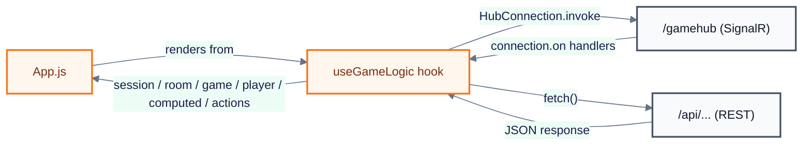
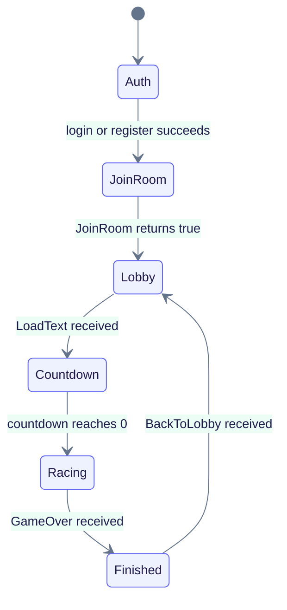

# Frontend

The client is a single-page React application in `typeracer-client`. It has no router and no external state library: one custom hook, `useGameLogic`, owns all client-side state and renders one of several views conditionally inside a single component. The client talks to the Api project over REST (`/api/...`) and to the SignalR hub over `/gamehub`, both addressed with relative URLs so the browser resolves them against whatever origin served the page (the nginx container in Docker, or the CRA dev server locally).

## Stack and scripts

Versions and scripts are read from [`typeracer-client/package.json`](../../typeracer-client/package.json).

| Item | Value |
|---|---|
| Framework | React `^19.2.4` |
| Build tooling | `react-scripts` `5.0.1` (Create React App) |
| Realtime client | `@microsoft/signalr` `^10.0.0` |
| `npm start` | runs the CRA dev server |
| `npm run build` | produces a static production build in `build/` |
| `npm test` | runs `react-scripts test` |

Styling is a mix of a stylesheet ([`typeracer-client/src/App.css`](../../typeracer-client/src/App.css)) and inline `style` props set directly in JSX. [`typeracer-client/public/index.html`](../../typeracer-client/public/index.html) also loads Google Fonts links and a Tailwind CSS CDN `<script>` with an inline `tailwind.config`, in addition to the CRA-generated stylesheet.

## Source layout

| File | Role |
|---|---|
| [`typeracer-client/src/index.js`](../../typeracer-client/src/index.js) | React entry point; mounts `App` into `#root` inside `React.StrictMode` |
| [`typeracer-client/src/App.js`](../../typeracer-client/src/App.js) | Single screen component; renders Auth, join-room, lobby, and race/finished views conditionally based on hook state |
| [`typeracer-client/src/Auth.js`](../../typeracer-client/src/Auth.js) | Login/register form, toggled between the two modes |
| [`typeracer-client/src/GameLogic.js`](../../typeracer-client/src/GameLogic.js) | `useGameLogic` hook: all React state, the SignalR connection, HTTP calls, action handlers, and text-highlighting logic |
| [`typeracer-client/src/App.css`](../../typeracer-client/src/App.css) | Stylesheet for panels, buttons, inputs, and debuff/buff animations |

`Game.css` and `logo.svg` are present in `src/` but are not imported by `index.js`, `App.js`, `Auth.js` or `GameLogic.js`. `App.test.js`, `setupTests.js`, `reportWebVitals.js` and `index.css` are the unmodified Create React App boilerplate.

## State model (useGameLogic)

[`GameLogic.js`](../../typeracer-client/src/GameLogic.js) holds four `useState` objects plus derived/computed values:

| State | Fields (initial values) |
|---|---|
| `session` | `isAuth: false`, `username: ""` |
| `room` | `code: ""`, `isJoined: false`, `players: []`, `chat: []`, `opponents: {}`, `host: ""`, `settings: { powerUpsEnabled: false, hardMode: false, secondsToEnd: 0 }` |
| `game` | `status: "lobby"`, `text: "Loading..."`, `countdown: 0`, `winner: ""`, `leaderboard: []`, `timeRemaining: null` |
| `player` | `input: ""`, `progress: 0`, `wpm: 0`, `hasError: false`, `totalKeys: 0`, `wrongKeys: 0`, `powerUp: null`, `debuff: null`, `buff: null` |

`computed` (via `useMemo`/plain expressions) exposes `accuracy` (from `totalKeys`/`wrongKeys`) and `powerUpProgress` (a 0–100 value driven by consecutive correctly typed characters). `inputRef` is a `useRef` attached to the race text input so the hook can force-focus it.

`actions` exposes exactly these functions: `setIsAuthenticated`, `setCurrentPlayer`, `setRoomCode`, `handleInputChange`, `handleSpecialKeys`, `handleUsePowerUp`, `handleRestart`, `sendChatMessage`, `handleJoinRooms`, `handleStart`, `handleChangeSettings`, `renderHighlightedText`.

The following diagram shows how `App.js` consumes the hook, and how the hook talks to the network.

## View flow

`App.js` renders a single view at a time, chosen by a chain of conditions on `session`, `room` and `game.status`.

**Auth** (`!session.isAuth`): the login/register form from `Auth.js`, with a "Login"/"Register" heading, `PLAYER NAME` and `PASSWORD` inputs, a submit button ("Log In" or "Create Account"), and a toggle link between the two modes.

**JoinRoom** (`session.isAuth && !room.isJoined`): a "Join a Room" panel with an uppercase room-code input and a "JOIN GAME" button.

**Lobby** (`game.status === "lobby"`): shows the room code, a players list tagging the host as `[HOST]` and everyone else as `[PILOT]`, a settings panel (Power-Ups toggle, Hard Mode toggle, Time Limit +/- stepper) that is only editable by the host (`session.username === room.host`), and a host-only "START RACE" button.

**Countdown** (`game.status === "countdown"`, `game.countdown > 0`): a large numeric countdown, followed by a transient "START!" message once it reaches zero.

**Racing** (`game.status === "racing"`): a HUD row with WPM, accuracy % and progress %, a progress bar, an opponents panel with per-opponent progress bars and (when the local player holds a power-up) a "USE `<POWERUP>`" button per opponent, the highlighted race text, and the race input (`onPaste` calls `preventDefault`, blocking pasted text). When `room.settings.powerUpsEnabled` is on, a power-up progress bar and a "Power-up ready: `<name>` (Press CTRL)" hint are shown. If someone finishes early and `room.settings.secondsToEnd > 0`, a "Time to end: `<n>`s" countdown appears, followed by a "FINISHING RACE..." message once it hits zero.

**Finished** (`game.status === "finished"`): a results panel titled "VICTORY!" (for the winner) or "WINNER: `<name>`" (for everyone else), showing the player's average WPM and accuracy; a host-only "PLAY AGAIN" button; and, once the leaderboard has loaded, a "GLOBAL LEADERBOARD (TOP 10)" table with `#`, `NICKNAME`, `PLAYED`, `WIN RATE` and `BEST WPM` columns.

## Server communication

### REST

| Method & path | Called from | Body | Auth header |
|---|---|---|---|
| `POST /api/Login` | `Auth.js` | `{ username, password }` | none |
| `POST /api/Register` | `Auth.js` | `{ username, password }` | none |
| `POST /api/savescore` | `GameLogic.js`, when `game.status` becomes `"finished"` | `{ Username, Wpm, IsWinner }` | `Authorization: Bearer <token>` |
| `GET /api/leaderboard` | `GameLogic.js`, when `game.status` is `"lobby"` or `"finished"` | — | none |

All four URLs are relative, so they resolve against the page's own origin — the nginx container in the Docker setup. Payload shapes on the Api side are documented in [`../backend/endpoints.md`](../backend/endpoints.md).

### SignalR

The connection is built with `new HubConnectionBuilder().withUrl("/gamehub", { accessTokenFactory }).withAutomaticReconnect().build()`, where `accessTokenFactory` returns the stored JWT (stripped of characters outside `[a-zA-Z0-9_.-]`). Event handlers are registered only after `connection.start()` resolves. An `invoke` helper wraps `connection.invoke`, calling it only when `connection.state === "Connected"`.

Events handled (`connection.on`):

| Event | Updates |
|---|---|
| `UpdateState` | the caller's own `player.progress`/`hasError`/`wpm` if the payload's player matches the local username, otherwise `room.opponents[name]` |
| `UpdatePlayersList` | `room.players` and `room.host` |
| `BackToLobby` | resets `game` to `status: "lobby"`, resets `player` to its initial values, and clears `room.opponents` |
| `GameOver` | sets `game.winner` and `game.status = "finished"` |
| `PowerUpGranted` | sets `player.powerUp` |
| `SetUpLobby` | sets `room.settings` (initial lobby setup) |
| `SettingsUpdate` | sets `room.settings` (settings changed by host) |
| `ReceiveAttack` | sets `player.debuff` (or trims `player.input` for `"bomb"`), unless `player.buff === "shield"`, in which case the shield is consumed instead |
| `ReceiveDefense` | sets `player.buff` for 1.5s |
| `ReceiveChatMessage` | appends to `room.chat` |
| `LoadText` | sets `game.text`, starts a 3-second `game.countdown`, sets `game.status = "countdown"`, and resets `player` and `room.opponents` |

Methods invoked (`invoke(...)`):

| Method | Arguments |
|---|---|
| `JoinRoom` | `room.code` |
| `StartRoomGame` | `room.code` |
| `ChangeRoomSettings` | `room.code`, `powerUpsEnabled`, `hardMode`, `secondsToEnd` |
| `SendProgress` | current input string |
| `UsePowerUp` | `room.code`, `session.username`, target username, `player.powerUp` |
| `RestartGame` | — |
| `SendChatMessage` | `room.code`, `session.username`, message text |

`SendChatMessage` and `ReceiveChatMessage` are implemented on the client, but [`TypeRacerServer/Api/GameHub.cs`](../../TypeRacerServer/Api/GameHub.cs) defines no `SendChatMessage` method and never sends a `ReceiveChatMessage` event; the two have no server-side counterpart. Payload shapes for the other hub methods are documented in [`../backend/endpoints.md`](../backend/endpoints.md).

### Authentication state

`Auth.js` stores the JWT and username in `localStorage` (`token`, `username`) on a successful login. `GameLogic.js` restores `session` from `localStorage` on mount, clearing both keys if either is missing or the literal string `"undefined"`. `App.js` clears both keys on logout and resets `session` via `setIsAuthenticated(false)`/`setCurrentPlayer("")`.

## Gameplay on the client

After `LoadText` arrives, a 3-second countdown runs entirely client-side (`game.countdown`, decremented once per second), after which `game.status` flips to `"racing"` and the race input is focused. Every keystroke in the race input calls `SendProgress` with the full current text and locally tracks `totalKeys`/`wrongKeys` to compute the `accuracy` shown in the HUD; `player.wpm` itself comes from the server via `UpdateState`. A power-up is used either by pressing `Ctrl` (which targets a random opponent) or by clicking an opponent's "USE `<POWERUP>`" button.

Debuffs received through `ReceiveAttack` render as CSS classes: `freeze` disables the input, `flashbang` adds `flashbang-active` to the game container, `chaos` adds `chaos-active` to the text display, and `bomb` adds `bomb-active` to the container while also trimming 10 characters off the player's own typed input. A `shield` buff (from `ReceiveDefense`) is shown with a "SHIELD ACTIVE!" banner and a `shield-active` input class, and consumes the next incoming attack instead of applying its debuff.

When a player reaches 100% progress (or an opponent does) and `room.settings.secondsToEnd > 0`, a local "time to end" countdown starts; when it reaches zero, the round is treated as finishing. When `game.status` becomes `"finished"`, the client posts the score to `/api/savescore` and refetches `/api/leaderboard` to refresh the results table.

## Build and serving

`npm run build` compiles the app into `typeracer-client/build/`. [`typeracer-client/Dockerfile`](../../typeracer-client/Dockerfile) builds it in a `node:24-alpine` stage (`npm ci` + `npm run build`) and copies the output into an `nginx:alpine` stage. [`typeracer-client/nginx.conf`](../../typeracer-client/nginx.conf) serves the SPA with a `try_files $uri $uri/ /index.html` fallback, and proxies `/api/` and `/gamehub` to `backend:8080`, adding the `Upgrade`/`Connection` headers needed for the WebSocket handshake on `/gamehub`.

`npm start` runs CRA's dev server on port 3000. `package.json` has no CRA `proxy` field, so in that mode the relative `/api/...` and `/gamehub` calls need a backend reachable on the same origin as port 3000; the Docker Compose setup instead puts nginx in front of both the static build and the backend so relative URLs resolve correctly (see [`docker-compose.yml`](../../docker-compose.yml)).

## Related documents

- [Documentation index](../README.md)
- [Architecture](../architecture.md) — overall system architecture
- [Endpoints and SignalR contract](../backend/endpoints.md) — payload reference
